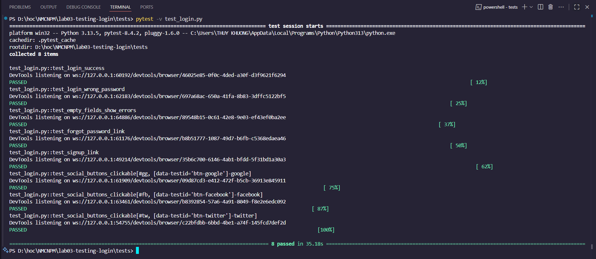

# 🧪 Lab 03 — Testing Login Form (Selenium + Pytest)

> Kiểm thử **form đăng nhập** chạy **HTML local**. Bộ mã gồm giao diện (HTML/CSS/JS) và kịch bản kiểm thử tự động bằng **Selenium WebDriver** + **Pytest**.  
> Kết quả hiện tại: **8/8 test passed** ✅

---

## 📸 Minh hoạ
- Use Case: `image/Login_Usecase.png`  
- Kết quả chạy test: `image/Test_result.png`




---

## 🔎 Phạm vi kiểm thử 
1. **Login thành công** với thông tin hợp lệ.  
2. **Sai mật khẩu** → hiện thông báo lỗi.  
3. **Bỏ trống** email/username hoặc mật khẩu → hiện cảnh báo cho từng trường.  
4. Link **Forgot password?** → điều hướng `Forgot.html`.  
5. Link **Sign up** → điều hướng `Signup.html`.  
6. **3 nút Social** (Google / Facebook / Twitter) có phản hồi khi click.

---

## 🧱 Công nghệ
- **Python 3.10+**
- **Selenium 4**, **webdriver-manager**
- **Pytest 8**
- **Google Chrome** 

---

## 📂 Cấu trúc thư mục
```
Lab_3/
├─ Login/
│  ├─ Login.html
│  ├─ Forgot.html
│  └─ Signup.html
├─ tests/
│  └─ test_login.py          # Kịch bản kiểm thử
├─ image/
│  ├─ Login_Usecase.png      # Sơ đồ use case
│  └─ Test_result.png        # Ảnh kết quả chạy test
├─ requirements.txt
└─ README.md
```
> Nếu khác cấu trúc, chỉ cần sửa đường dẫn trong file test (mục **Cấu hình**).

---

## ⚙️ Cài đặt & Cấu hình

### 1) Cài môi trường
```bash
python -m venv .venv
# Windows
.venv\Scripts\activate
# macOS/Linux
# source .venv/bin/activate

pip install -U pip
pip install -r requirements.txt
# hoặc
# pip install selenium webdriver-manager pytest pytest-html
```

### 2) Cấu hình đường dẫn HTML trong `tests/test_login.py`
```python
from pathlib import Path
LOGIN_HTML = Path(r"D:\hoc\NMCNPM\lab03-testing-login\Login\Login.html").resolve().as_uri()

HEADLESS = False  # True nếu muốn headless (CI nhanh hơn)
```

---

## 🏃 Chạy test
```bash
# chạy toàn bộ
pytest -v

# (tuỳ chọn) báo cáo HTML self-contained
pytest -v tests/test_login.py --html=report.html --self-contained-html
```

---

## 🧭 Chiến lược Locator & Dữ liệu demo

**Locator chính** (viết gọn, ưu tiên `id`/`data-testid`):
- Input: `#email` (hoặc `#username`), `#password`  
- Nút đăng nhập: `#btnLogin` (fallback `button[type="submit"]`)  
- Link: `a.hint[href*="Forgot"]`, `a[href*="Signup"]`  
- Social: `#gg`, `#fb`, `#tw`  
- Lỗi hiển thị: `#err-email`, `#err-password` (kiểm tra `display:block` hoặc có `innerText`)

**Dữ liệu demo** (được xử lý trong `Login.html`):
- USER: `user@example.com`  
- PASS: `secret123`  
Form sẽ `alert()` tương ứng: **“Đăng nhập thành công!”** hoặc **“Sai thông tin đăng nhập”**.

---

## ✅ Danh sách Test Case & Kỳ vọng

| TC | Mô tả | Bước thực hiện | Kỳ vọng |
|---|---|---|---|
| TC1 | Login thành công | Nhập `user@example.com` / `secret123` → **Đăng nhập** | Thông báo thành công (alert/status) |
| TC2 | Sai mật khẩu | Nhập đúng user, sai pass → **Đăng nhập** | Thông báo lỗi (*Sai/Invalid/Fail*) |
| TC3 | Bỏ trống trường | Để trống email/username và/hoặc password → **Đăng nhập** | `#err-email`, `#err-password` hiển thị |
| TC4 | Forgot password | Click **Forgot password?** | Điều hướng `Forgot.html` |
| TC5 | Sign up | Click **Đăng ký ngay** | Điều hướng `Signup.html` |
| TC6 | Social login | Click **Google/Facebook/Twitter** | Có phản hồi theo nút được chọn |

---

## 🧩 Use Case
- `Login` **extends** `Login Success` / `Login Fail`  
- `Login` **includes** `Validate Field`  
- `Forgot Password` **includes** `Send Reset Link` (qua Email/SMS)  
- `Social Login` **includes** `Authenticate with OAuth Provider` (Google/Facebook/Twitter)

---

## 🛠 Troubleshooting
- **Không mở được HTML** → kiểm tra `LOGIN_HTML` là **đường dẫn tuyệt đối** hoặc dùng `.as_uri()` như ví dụ.  
- **Chrome/driver khớp version** → để `webdriver-manager` tự tải; nếu mạng chặn, cài thủ công đúng version.  
- **Không tìm thấy phần tử** → mở `tests/test_login.py` và chỉnh lại CSS selector khớp với HTML.  
- **Chạy chậm** → bật `HEADLESS=True` và tắt animation CSS nếu có.

---

## ℹ️ Thông tin
- Môn: **Nhập môn Công nghệ Phần mềm**  
- Bài: **Lab 03 — Testing Login Form**  
- SV: **Lâm Thụy Khương — N23DCCN169 (PTIT HCM)**  
